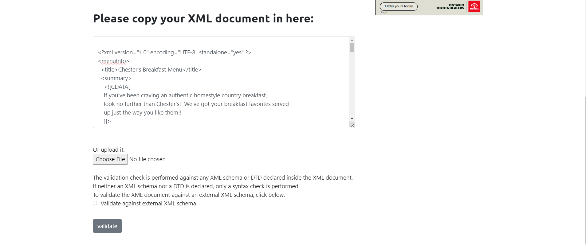
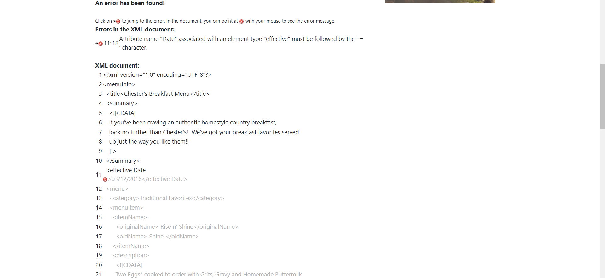
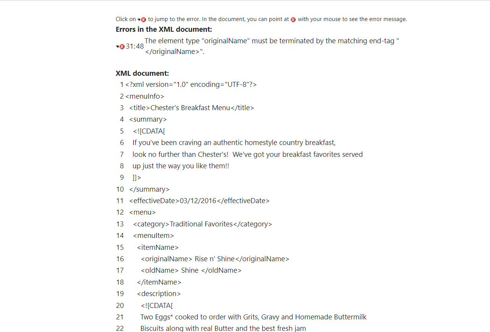
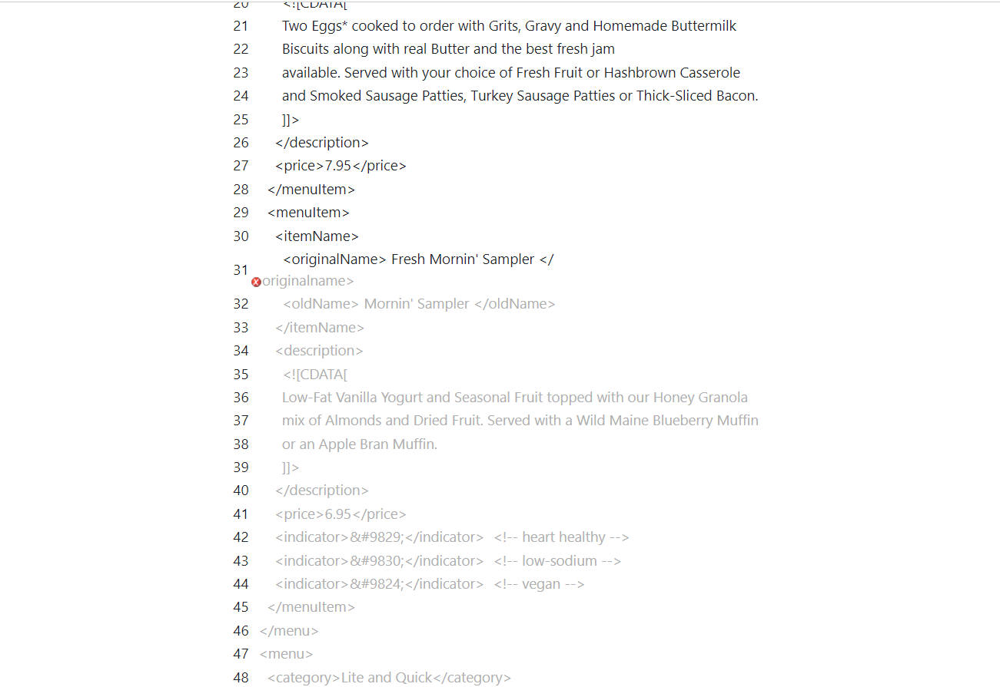
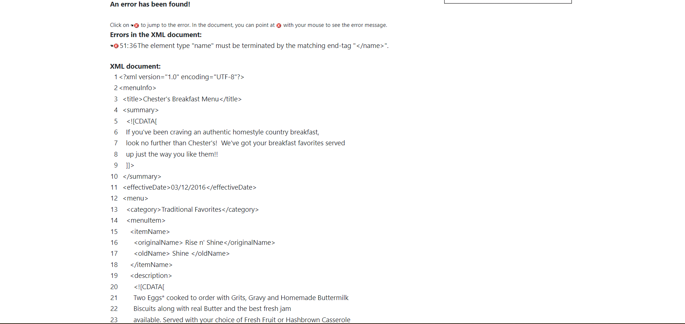
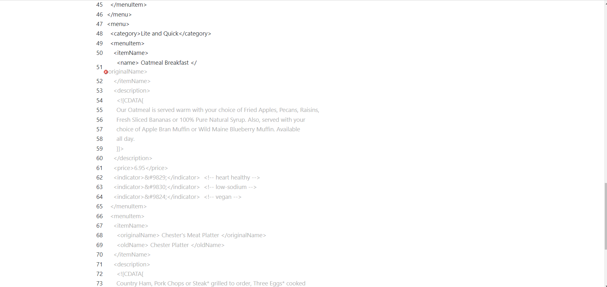
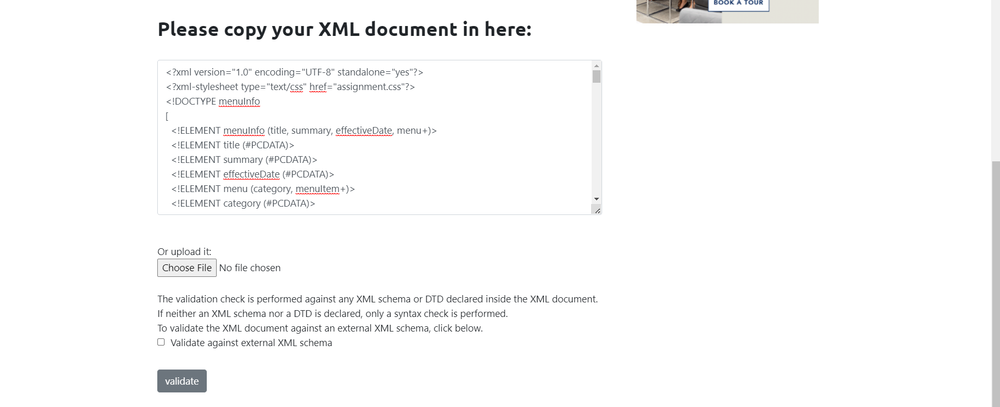

1. Open `module-2/assignments/assignment.xml` in your browser. Are there any errors? Explain the error and fix it.

Errors in the assignment.xml file:

1. <effective Date>03/12/2016</effective Date>
2. <originalName>Fresh Mornin' Sampler</originalname>
3. <name>Oatmeal Breakfast</originalName>

Errors Explained:

1. There is space between the tag element effective and Date which causes the error.The space must be eliminated.
2. The opening tag 'originalName' is not as same as closing tag 'originalname'. In the closing tag the letter 'n' must be capital 'N' to match the  opening tag originalName as xml is case sensitive.
3. At the beginning the tag only contains the word 'name' while the tag at the end consists of the word 'originalName', so the 'name' tag must be written as 'originalName' to solve the error.

Fixing the error:

1. <effectiveDate>03/12/2016</effectiveDate>
2. <originalName>Fresh Mornin' Sampler</originalName>
3. <originalName>Oatmeal Breakfast</originalName>

-----------------------------------------------------------------------------------------------------------------------------------------------------

2. What is the use of CDATA block in this document?

1. The CDATA stands for character data and it is used to parse the data within the xml document which cannot be interpreted by the XML markup.
2. Syntax for CDATA is <![CDATA[  content    ]]>.
3. Block of CDATA is also used to store the content having special characters, if written outside the CDATA block the xml markup will identify it as part of XML document or tags/attributes which may cause an error but xml provides references for some character data if CDATA block is not to be used.
4. In the assignment.xml the CDATA is used to describe the summary as well as description of menu and menuitems. It consists of special characters like !,*,' which written without CDATA block or use of references will give an error when xml document is parsed.
Inorder to avoid the error too CDATA block is used.

-----------------------------------------------------------------------------------------------------------------------------------------------------

4. Identify prolog, document body, and epilog in the document. Are there any processing instructions?

assignment.xml

1. Prolog:  <?xml version="1.0" encoding="UTF-8" standalone="yes"?>

2. Document body:

<!DOCTYPE menuInfo
[
  <!ELEMENT menuInfo(title, summary, effectiveDate, menu+)>
  <!ELEMENT title (#PCDATA)>
  <!ELEMENT summary (#PCDATA)>
  <!ELEMENT effectiveDate (#PCDATA)>
  <!ELEMENT menu (category, menuItem+)>
  <!ELEMENT category (#PCDATA)>
  <!ELEMENT menuItem (itemName+ , description, price, indicator)>
  <!ELEMENT itemName(originalName, oldName)>
  <!ELEMENT originalName(#PCDATA)>
  <!ELEMENT oldName(#PCDATA) IMPLIED>
  <!ELEMENT description (#PCDATA)>
  <!ELEMENT price (#PCDATA)>
  <!ELEMENT indicator (#PCDATA) IMPLIED>
]>

3. Epilog:  

<!--
Name: Vidhi Lad
Student ID: N01530621
-->

4. Processing Instructions:

There is processing instruction.
<?xml-stylesheet type="text/css" href="assignment.css"?>

-----------------------------------------------------------------------------------------------------------------------------------------------------

6. Verify that file is well-formed and valid.

The file is well-formed as it fulfills the syntax requirements of XML and the file is valid as well as it consists of appropriate DTD.

