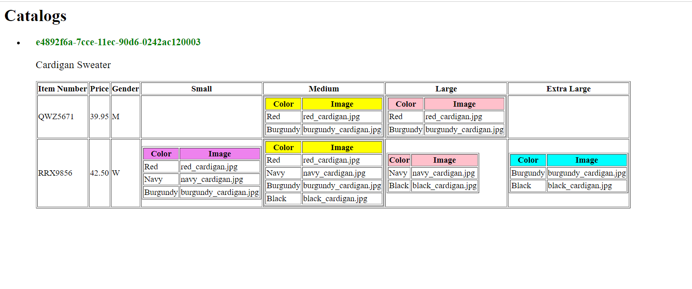

Create `module-4/assignments/assignment_YOURNAME.md` and explain your thought process in it. Add screenshots of each step to the file (Refer `week-1/assignments/evaluation-1.md` on how to add image to md file)

1. First the title is used to name the table "Catalog".
2. Than unordered list 'disc' is used for looping for each product as there is only one product it only views on screen in the output.
3. While looping through a product the product id and description is displayed under article using header and paragraph tag.
4. Than for viewing the catalog_items tabular format is used where first three columns are item number, price and gender.
5. In the Gender column the value of Men and Women is rendered using xsl:choose and xsl:when statement for M - Men and W-Women.
6. Next the subtable is generated for each size [Small, Medium, Large and Extra Large].
7. The subtable is created by using the xsl:if like if the size is small, medium, large and extra large two columns are created which presents the data about the color and image of the items.
8. Inside the subtable xsl:for-each is used for rendering the context of color_swatch and its attribute image.
9. At the end all the tags are closed in order.
